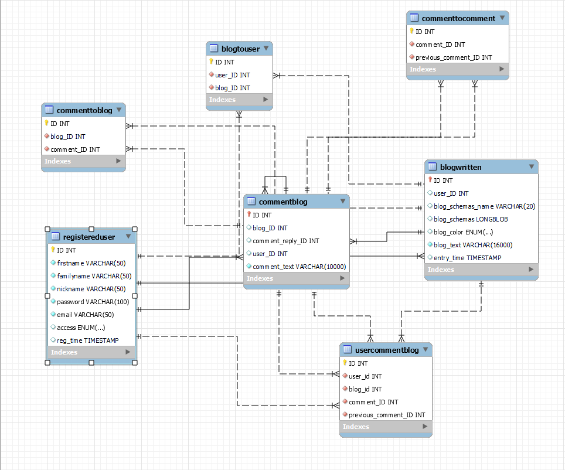

= BlogDatabase Planning

The following diagram I would like to create:

First step was creating the name of the tables, then the fields.

The last step was creating the switchboards. (it is not a must, you can make connections between tables in java, but regarding the tasks it was a must!)

After the database and the script was ready I created the database in MySQL server, as this program is connecting to an existing DB!

Created a maven project (the most suitable for the project!)

Script -> resources folder

Make packaging! Regarding my own concept!
I have separate database package, where the models, services, controllers and the connection itself is situated!

Service is responsible for safe storing of password! (overwrites the password and created a safe storing mode of it!)

Packages are speaking about themselves and what they are responsible for!

Extra util for printing and module with Processor where I build up the whole logic of the program! In the controller package I build up the logic one-by-one!

Access are enums, follow the logic and naming regarding SQL!

== SingletonConnection to Database

'''

I created the database connection with Singleton, as I need only 1 connection and not more!

== Testing with J-Unit 4

'''

Testing all the methods and connection itself not using mock! ... Testing the real methods and e.g. checking the size of the list but also make a double check and printing to console!

== Regarding roles and accesses

'''

Thought about it, planned, never learnt before, so could not solve (I thought about if access == admin etc. but did not know how to add different opportunity ... maybe with a sort of menu system ... )

== Queries

'''

Finally write queries and tests -> J-Unit 4